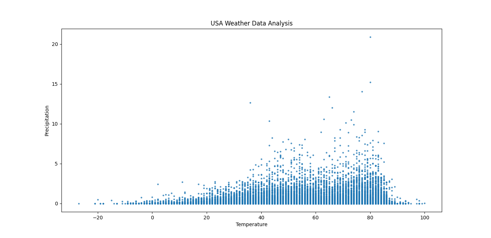
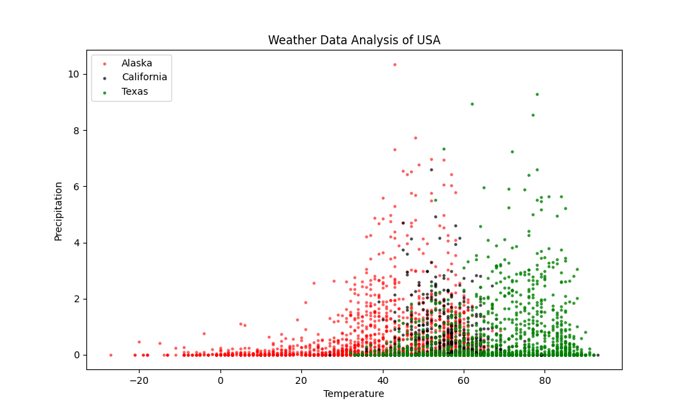
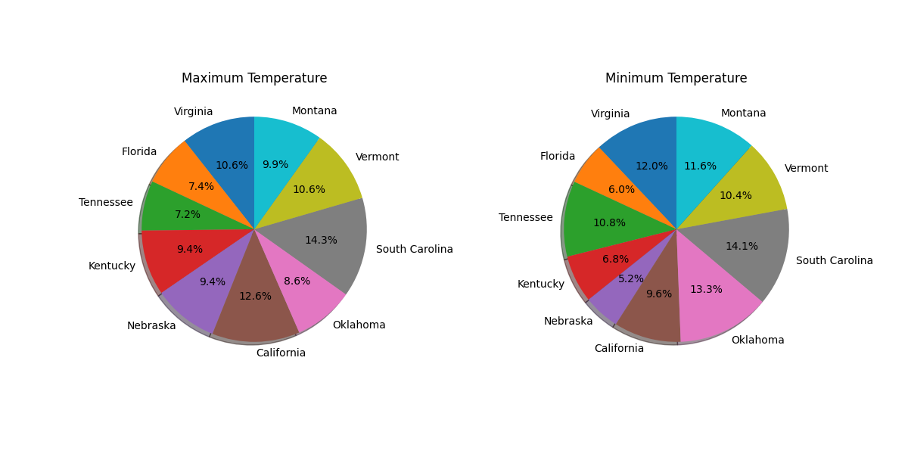

# WeatherDataAnalysis

**A Python project to analyze and visualize over 10 years of US weather data.**

---

## What It Does

- Analyzes large-scale weather data (temperature & precipitation)
- Stores data in MySQL for structured access
- Creates beautiful plots & pie charts with Python and Matplotlib
- Compares trends across multiple US states

---

## Screenshots

  

  

---

## Project Structure

- `src/Analysis.py` – General weather trend analysis  
- `src/State_Analysis.py` – State-wise comparison (e.g., CA, AK, TX)  
- `src/PieChart.py` – Pie charts for temperature extremes

---

## Technologies Used

- Python  
- NumPy  
- Matplotlib  
- MySQL  

---

## GitHub Repository

[View on GitHub](https://github.com/avik43218/WeatherDataAnalysis)

---

## License

Licensed under the [MIT License](./LICENSE)
